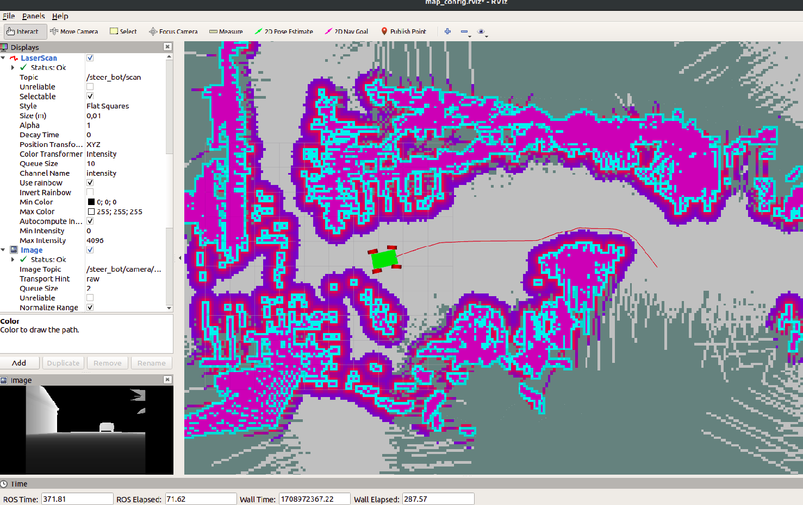

# Micropolis Robotics - Robotics Software Engineer Technical Assesment

## Project Overview

1. Mapping
2. Offline Localization
3. Autonomous Navigation 
4. GUI Teleoperation

## Setup
- Install general dependencies:
```
sudo apt-get install ros-melodic-ros-control  ros-melodic-gazebo ros-melodic-move-base ros-melodic-navigation
```
- Install laserscan-to-pointcloud package to convert 3D LIDAR data to 2D laserscans
```
sudo apt-get install ros-melodic-pointcloud-to-laserscan
```

## Milestones
Most of the milestone files are stored in the package `mybot_pkg`. 

### 1 - Preform a SLAM on the provided world
First, we need to construct a map of the environment to use it later for offline localization. To do this we have many options and SLAM algorithms to choose from. However, we need to decide based on our environment and sensor configuration. At first, since we have a 3D LIDAR we could use LIDAR-based approaches like Slam_toolbox and Gmapping. The issue with using these methods is first we are not taking advantage of the depth camera on the robot, and since we do not have a reliable source of odometry aside from Gazebo, we will have huge map drifts and inconsistices through out the SLAM process. That is why I decided to use RTAB-MAP. In short, RTAB-Map's real-time capabilities, compatibility with 3D sensor data, effective loop closure detection, user-friendly configuration, and integration with ROS collectively makes it an ideal solution for mapping and navigation for a robot that's equipped with a depth camera and a 3D LiDAR. 
 

But before working with Rtabmap, we have to change the width of the depth image to be equal or smaller than the color image! [reference issue](https://github.com/introlab/rtabmap/issues/753). 
```
  <!-- RSE_ws/src/realsense2_description/urdf/_d435.gazebo.xacro -->
<image>
    <width>640</width>
    <height>480</height>
</image
```
We also need to generate a laserscan to use for ICP odometry to get better results in RTAB-MAP. We can do this using the `pointcloud-to-laserscan` package
```
sudo apt-get install ros-melodic-pointcloud-to-laserscan
``` 

- Now we can launch the `mybot_slam.launch` file
```
roslaunch mybot_pkg mybot_slam.launch
```
- Move the robot around manually 
```
rosrun teleop_twist_keyboard teleop_twist_keyboard.py /cmd_vel:=steer_bot/ackermann_steering_controller/cmd_vel
```
- save the map (or you can just use the Rtabmap DB file)
```
rosrun map_server map_saver map:=/rtabmap/grid_map -f my_map
```

### 2 - Offline Localization
Next, to move the robot autonomously around the map we need to localize the robot in real-time without using SLAM (offline localization).</br>

To do this, offline localization is implemented using RTAB-Map. But first, let's delve into why RTAB-Map is chosen for offline localization over AMCL. Offline localization using RTAB-Map involves loading a pre-existing map generated during the mapping phase. The robot then uses this map to determine its current position without actively exploring the environment.

Choosing RTAB-Map for offline localization brings several advantages. Firstly, RTAB-Map provides a flexible and efficient way to use pre-existing maps for localization. It handles loop closure detection well, which means it can recognize and correct for errors that might occur during mapping. This capability enhances the accuracy and reliability of robot localization, especially in complex environments.

Comparatively, while AMCL is a powerful online localization algorithm, it might not be the optimal choice for scenarios where a pre-existing map is available. AMCL typically relies on the robot's motion and sensor data to estimate its pose in real-time. In offline scenarios, where the robot is not actively moving, AMCL may not perform as effectively as RTAB-Map.

Nevertheless, I have included files for localization using both AMCL and RTAB-MAP but after several tests I decided to continue with RTAB-MAP for this step.  

- launch the `mybot_slam.launch` file with localization enabled
```
roslaunch mybot_pkg mybot_slam.launch
```
- You can also do offline localization uing AMCL
```
roslaunch mybot_pkg amcl_loc.launch
```

### 3 - Autonomous Navigation with Obstacle avoidance
For the local planner, since we have a car-like robot using ackermann controller we can't use the default planner used for differential robots in Navigation Stack. Instead, we need to insall and setup the TEB controller which unlike other controllers, can send velocities and angles which is what we need here
```
sudo apt install ros-melodic-teb-local-planner
```
After installing it we can configure the navigation stack to use it in the `teb_local_planner_params.yaml` file.</br>

- Now to use autonomous navigation you can choose either rtabmap or amcl for localization. To do so, you just need to change the map topic in the `common_costmap_params.yaml` file. After that you can just run the Navigation Stack using the move_base file
```
roslaunch mybot_pkg move_base.launch
```


### 4 - External GUI Teleoperation
For this step, I developed a web-based Graphical User Interface (GUI) using Flask for remotely controlling a robot within a ROS environment. The Flask application (`app.py`) served as the web server, defining routes for the main page and the control form. ROS functionalities were integrated into the Flask application, establishing a ROS node and publishers for transmitting drive and steer commands to the robot. The HTML template (`index.html`) provided a user-friendly interface, enabling users to input drive and steer values. The entire task was structured within a ROS package, adhering to the typical ROS package structure. This setup facilitates the remote control of the robot through a web browser, making it accessible and user-friendly for operators interacting with the robot system.

You can run this using the command
```
python3 <path_to_ROS_workspace>/src/mybot_gui/src/teleop_app.py
```
You can then access it from the browser
```
http://localhost:5000
```


### (Optional) - Develop an Odometry Source for the robot
To develop an odometry system without using the odometry published from Gazebo we have tp take into considerations the sensors we have in our system. SInce we don't have an IMU or wheel encoder we need to rely on the data coming from the 3D LIDAR and Depth camera sensors. With this in mind, here are two possible ways to develop a more advanced odometry system for our robot.

#### ICP Odometry with Visual Odometry Initialization in ROS
> File `RSE_ws/src/mybot_pkg/launch/optional_odom_rgbdicp.launch`


This ROS launch file configures an odometry system utilizing Iterative Closest Point (ICP) algorithm with Visual Odometry (VO) initialization. The system uses sensor data from the depth camera mounted on the robot to perform real-time odometry estimation.

#### Fused odometry using Extended Kalman Filter
> File `RSE_ws/src/mybot_pkg/launch/optional_odom_ekf.launch`


In this approach we configure a robot localization system using an Extended Kalman Filter (EKF) through the robot_localization package. The system integrates odometry and pose data coming from RTAB-MAP to estimate the robot's state, providing a fused and more accurate localization solution.

```
THANK YOU!
```
